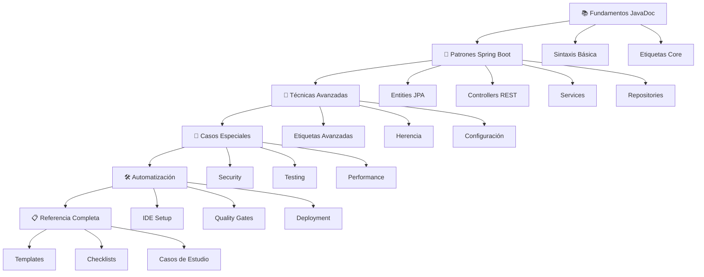

# 📚 Cuaderno JavaDoc Profesional

<div align="center">


**De Estudiante a Developer: La Guía Definitiva para Documentación Enterprise**

*Domina JavaDoc como un Senior Developer - desde fundamentos hasta técnicas avanzadas*

---

### 🎯 **¿Por qué este cuaderno?**

La **documentación profesional** es lo que separa a un desarrollador junior de uno senior. Este cuaderno te llevará desde cero hasta dominar JavaDoc al nivel enterprise, con ejemplos reales y técnicas probadas en la industria.

</div>

---

## 🚀 **Inicio Rápido**

```bash
# Clona el repositorio
git clone https://github.com/ZairaMartin/javadoc-apuntes

# Navega al directorio
cd javadoc-apuntes

# Explora la documentación
cd docs/01-fundamentos
```

---

## 📖 **Índice Completo**

### 🏗️ **PARTE I: FUNDAMENTOS SÓLIDOS**

<table>
<tr>
<td width="50%">

#### **📌 1. Introducción a JavaDoc**
- 🎯 **1.1** ¿Qué es JavaDoc y por qué es crítico?
- 🎯 **1.2** JavaDoc vs Comentarios: cuándo usar cada uno
- 🎯 **1.3** Configuración del entorno (IDE, plugins)
- 🎯 **1.4** Generación básica de documentación

#### **📌 2. Sintaxis y Estructura Base**
- ✍️ **2.1** Anatomía del bloque JavaDoc
- ✍️ **2.2** Formato y convenciones de escritura
- ✍️ **2.3** HTML en JavaDoc: qué usar y qué evitar
- ✍️ **2.4** Enlaces internos y referencias cruzadas

</td>
<td width="50%">

#### **📌 3. Etiquetas Esenciales (Core Tags)**
- 🏷️ **3.1** `@param` - Documentando parámetros profesionalmente
- 🏷️ **3.2** `@return` - Describiendo valores de retorno
- 🏷️ **3.3** `@throws` / `@exception` - Manejo de excepciones
- 🏷️ **3.4** `@see` - Referencias y enlaces relacionados
- 🏷️ **3.5** `@since` - Versionado y compatibilidad

> **🎓 Al completar esta parte:** Tendrás una base sólida para documentar cualquier código Java de manera profesional.

</td>
</tr>
</table>

---

### 🌱 **PARTE II: PATRONES SPRING BOOT**

<table>
<tr>
<td width="50%">

#### **📌 4. Documentando Entities (JPA)**
- 🗃️ **4.1** Entidades básicas: `User`, `Author`, `Book`
- 🗃️ **4.2** Relaciones complejas: `@OneToMany`, `@ManyToMany`
- 🗃️ **4.3** Validaciones Jakarta: `@NotNull`, `@Valid`, etc.
- 🗃️ **4.4** Mapeos y estrategias de persistencia
- 🗃️ **4.5** 💼 **Caso práctico:** Entity `Publisher`

#### **📌 5. Controllers REST Profesionales**
- 🌐 **5.1** Documentando endpoints HTTP
- 🌐 **5.2** Parámetros: `@PathVariable`, `@RequestBody`
- 🌐 **5.3** Responses y códigos de estado
- 🌐 **5.4** Validaciones y error handling
- 🌐 **5.5** 💼 **Caso práctico:** `BookController`

</td>
<td width="50%">

#### **📌 6. Services y Lógica de Negocio**
- ⚙️ **6.1** Métodos de negocio complejos
- ⚙️ **6.2** Transaccionalidad: `@Transactional`
- ⚙️ **6.3** Manejo de excepciones custom
- ⚙️ **6.4** Métodos asíncronos: `@Async`
- ⚙️ **6.5** 💼 **Caso práctico:** `OrderService`

#### **📌 7. Repositories y Acceso a Datos**
- 🔍 **7.1** Métodos query derivados
- 🔍 **7.2** `@Query` personalizedas (JPQL, SQL nativo)
- 🔍 **7.3** Parámetros dinámicos y `Pageable`
- 🔍 **7.4** Proyecciones y DTOs
- 🔍 **7.5** 💼 **Caso práctico:** `BookRepository`

</td>
</tr>
</table>

> **🎓 Al completar esta parte:** Dominarás la documentación específica de Spring Boot y podrás documentar cualquier aplicación enterprise.

---

### 🎨 **PARTE III: TÉCNICAS AVANZADAS**

<table>
<tr>
<td width="33%">

#### **📌 8. Etiquetas Avanzadas**
- 🏆 **8.1** `@author` y `@version`
- 🏆 **8.2** `@deprecated` responsable
- 🏆 **8.3** `@apiNote`, `@implSpec`
- 🏆 **8.4** `@serial`, `@serialField`
- 🏆 **8.5** `@hidden`, `@index` (Java 9+)

</td>
<td width="33%">

#### **📌 9. Herencia y Sobrescritura**
- 🧬 **9.1** `{@inheritDoc}` inteligente
- 🧬 **9.2** Clases abstractas
- 🧬 **9.3** Interfaces y implementaciones
- 🧬 **9.4** Métodos sobrescritos

</td>
<td width="34%">

#### **📌 10. Documentación de Configuración**
- ⚡ **10.1** `@Configuration` classes
- ⚡ **10.2** `@Bean` methods
- ⚡ **10.3** Properties y profiles
- ⚡ **10.4** Security configurations

</td>
</tr>
</table>

---

### 🔐 **PARTE IV: CASOS ESPECIALES**

<table>
<tr>
<td width="33%">

#### **📌 11. Security & OAuth**
- 🛡️ **11.1** Endpoints seguros
- 🛡️ **11.2** Roles y permisos
- 🛡️ **11.3** OAuth flows
- 🛡️ **11.4** JWT y sesiones

</td>
<td width="33%">

#### **📌 12. Testing & Doc**
- 🧪 **12.1** Test classes
- 🧪 **12.2** `@TestMethodOrder`
- 🧪 **12.3** Mocks y behavior
- 🧪 **12.4** Integration tests

</td>
<td width="34%">

#### **📌 13. Performance & Optimización**
- 🚀 **13.1** Complejidad algorítmica
- 🚀 **13.2** Memory usage
- 🚀 **13.3** Caching strategies
- 🚀 **13.4** Lazy loading

</td>
</tr>
</table>

---

### 🛠️ **PARTE V: HERRAMIENTAS Y AUTOMATIZACIÓN**

<table>
<tr>
<td width="33%">

#### **📌 14. Configuración IDE**
- 💻 **14.1** IntelliJ IDEA setup
- 💻 **14.2** Maven JavaDoc plugin
- 💻 **14.3** Gradle tasks
- 💻 **14.4** GitHub Actions

</td>
<td width="33%">

#### **📌 15. Quality Gates**
- ✅ **15.1** Checkstyle rules
- ✅ **15.2** SonarQube integration
- ✅ **15.3** Custom linting
- ✅ **15.4** CI/CD pipelines

</td>
<td width="34%">

#### **📌 16. Publicación**
- 📤 **16.1** GitHub Pages
- 📤 **16.2** Custom stylesheets
- 📤 **16.3** Search functionality
- 📤 **16.4** Mobile responsive

</td>
</tr>
</table>

---

### 📋 **PARTE VI: REFERENCIA RÁPIDA**

<details>
<summary><strong>🎨 Templates Copy-Paste</strong></summary>

#### **📌 17. Templates Profesionales**
- 📄 **17.1** 📋 Entity Template
- 📄 **17.2** 📋 Controller Template  
- 📄 **17.3** 📋 Service Template
- 📄 **17.4** 📋 Repository Template
- 📄 **17.5** 📋 Exception Template

</details>

<details>
<summary><strong>✅ Checklists de Calidad</strong></summary>

#### **📌 18. Quality Checklists**
- ☑️ **18.1** Pre-commit checklist
- ☑️ **18.2** Code review checklist
- ☑️ **18.3** Release documentation
- ☑️ **18.4** Performance checklist

</details>

<details>
<summary><strong>🏢 Casos de Estudio Enterprise</strong></summary>

#### **📌 19. BookStore - Casos Completos**
- 💼 **19.1** User Management & Authentication
- 💼 **19.2** Catalog & Inventory System
- 💼 **19.3** Order Processing & Payment
- 💼 **19.4** Security & Authorization

</details>

<details>
<summary><strong>🔗 Recursos y Enlaces</strong></summary>

#### **📌 20. Recursos Adicionales**
- 🌐 **20.1** Enlaces oficiales Oracle
- 🛠️ **20.2** Herramientas recomendadas
- 📚 **20.3** Proyectos Open Source ejemplares
- 👥 **20.4** Comunidad y learning resources

</details>

---

## 🎯 **Roadmap de Aprendizaje**


---

## 🏆 **Lo que Aprenderás**

<div align="center">

| **Nivel Inicial** 👶 | **Nivel Intermedio** 💪 | **Nivel Avanzado** 🚀 | **Nivel Enterprise** 🏢 |
|:---:|:---:|:---:|:---:|
| Sintaxis básica | Patrones Spring Boot | Etiquetas avanzadas | Automatización completa |
| Etiquetas core | Entities y Controllers | Herencia inteligente | Quality gates |
| Documentación simple | Services y Repositories | Configuraciones | CI/CD integration |
| HTML básico | Validaciones JPA | Testing documentation | Enterprise deployment |

</div>

---

## 🤝 **Contribuir**

¿Quieres mejorar este cuaderno? ¡Las contribuciones son bienvenidas!

1. 🍴 Fork el repositorio
2. 🌿 Crea una rama feature (`git checkout -b feature/mejora-seccion-x`)
3. ✍️ Haz tus cambios y commits (`git commit -m 'Mejora documentación sección X'`)
4. 📤 Push a la rama (`git push origin feature/mejora-seccion-x`)
5. 🔄 Abre un Pull Request

### **Áreas donde necesitamos ayuda:**
- 📝 Revisión de contenido técnico
- 🌐 Traducción a otros idiomas
- 🎨 Mejoras en el diseño visual
- 💡 Nuevos casos de estudio
- 🐛 Corrección de errores

---

## 📜 **Licencia**

Este proyecto está bajo la Licencia MIT. Ve el archivo [LICENSE](LICENSE) para más detalles.

---

## 👨‍💻 **Autor**

**Zaira Martín**  
🎓 Estudiante DAW | 💻 Futura Senior Developer  
📧 [tu-email@ejemplo.com](mailto:tu-email@ejemplo.com)  
🔗 [LinkedIn](https://linkedin.com/in/tu-perfil) | 🐙 [GitHub](https://github.com/tu-usuario)

---

<div align="center">

### ⭐ **Si este cuaderno te ayuda, ¡dale una estrella!**

*Ayúdanos a llegar a más desarrolladores que quieren dominar JavaDoc profesional*

**📚 Hecho con ❤️ para la comunidad de developers**

---


</div>